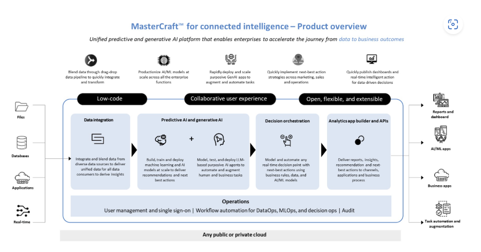
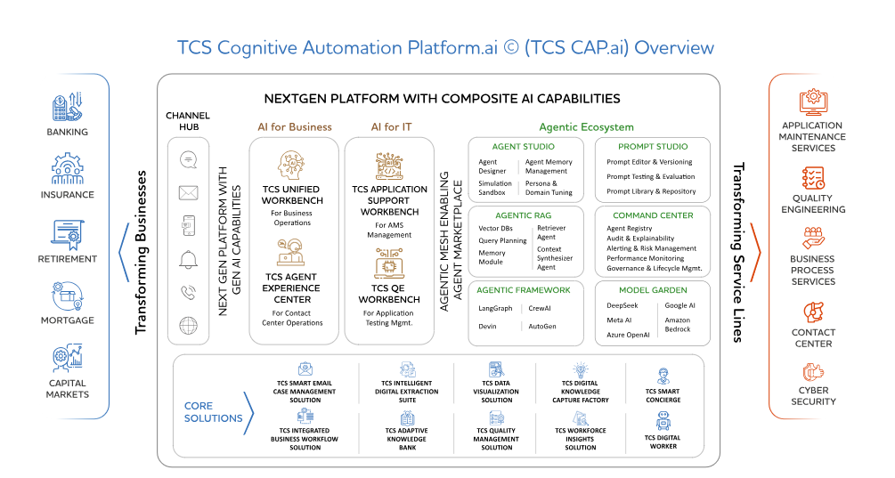
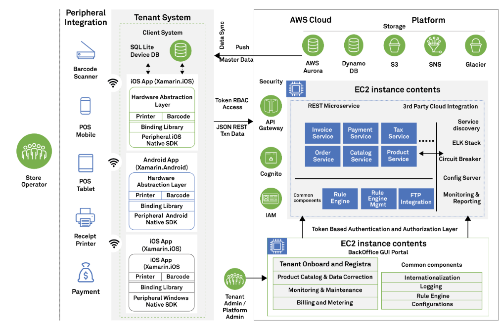
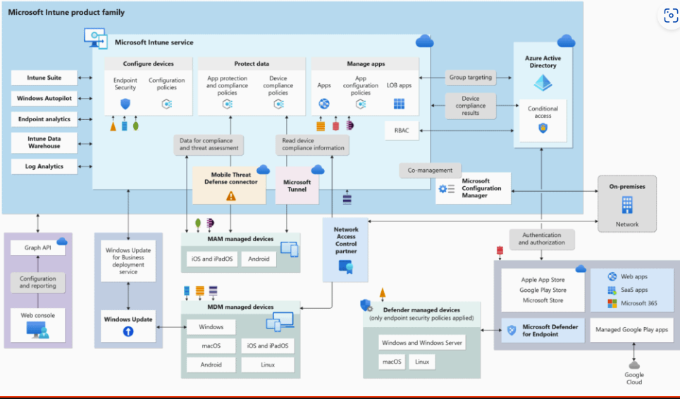
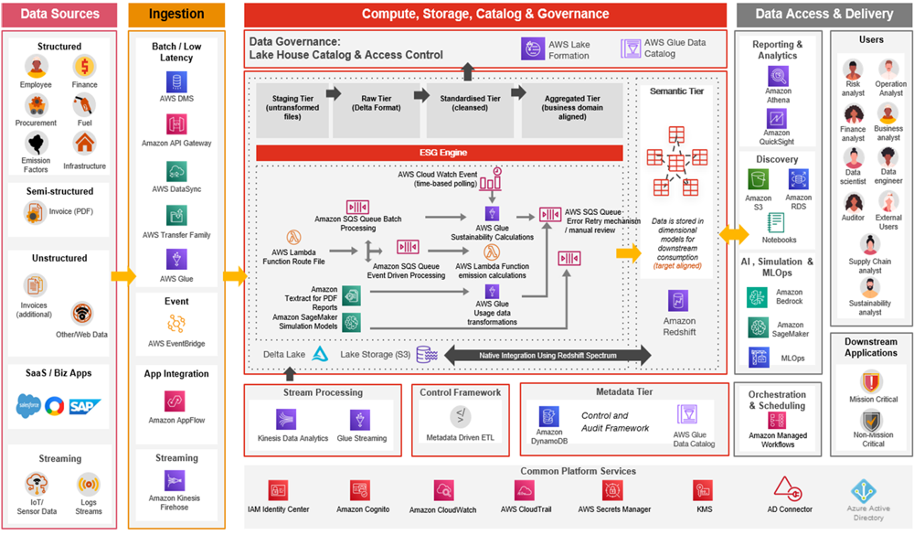
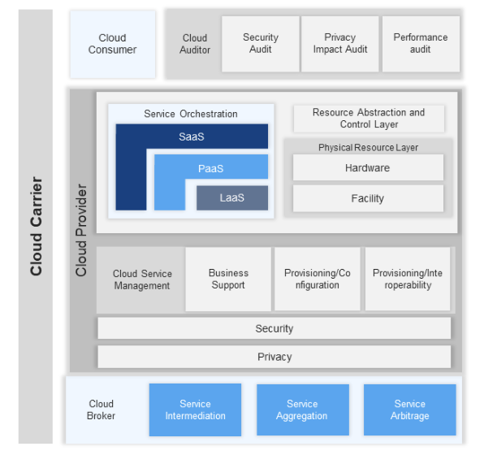
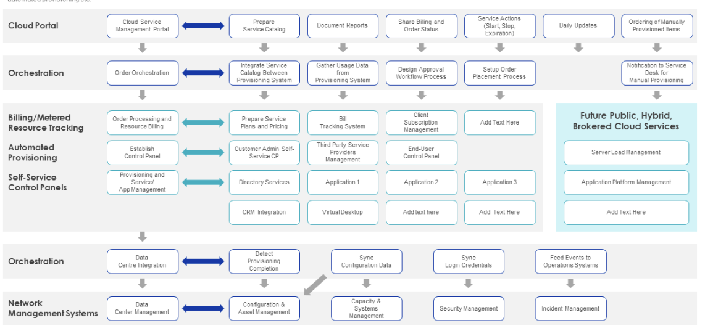
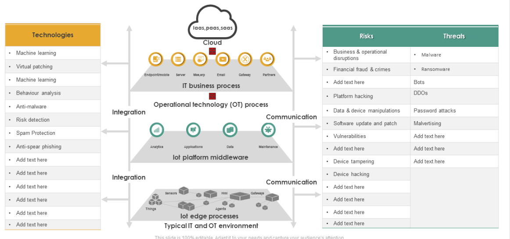
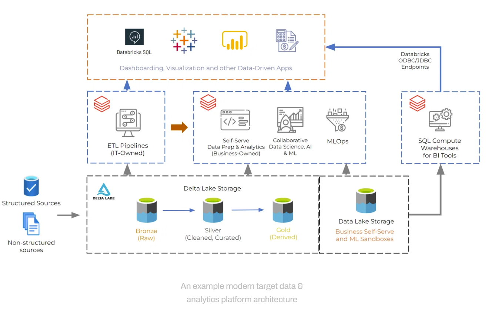
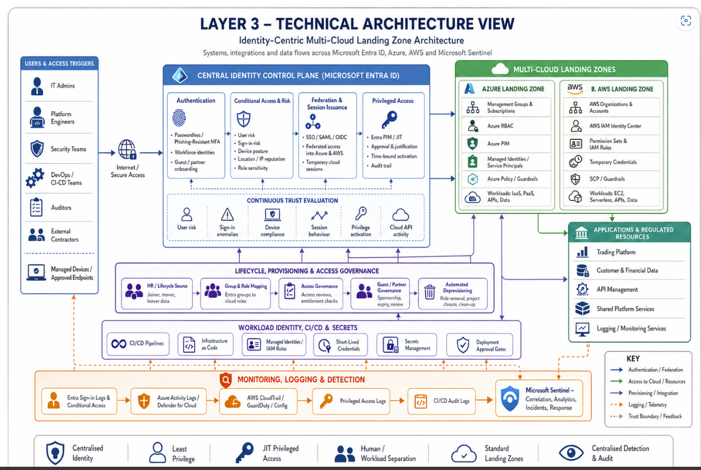

# Reference Layout Gallery for Solution Architecture Diagrams

> These examples are **layout and style references only**. They are not to be copied literally.
> The purpose of this gallery is to help the skill choose **how to organize information**, **how to emphasize hierarchy**, and **how to borrow an appropriate color segmentation strategy** before the diagram is rendered using drawio-skill.

## How to use this gallery
For any architecture request:
1. Pick the closest layout family.
2. Study the box placement and hierarchy grammar, not the exact artwork.
3. Borrow only the appropriate **color mood**, **container structure**, and **flow direction**.
4. Use the selected family to build a drawio-skill prompt.
5. Render the final diagram as original work.

## What the skill should learn from each reference
For each asset, the skill should extract:
- **layout family** — column, swimlane, control-plane, stack, matrix, or lakehouse flow
- **dominant anchor** — the visual object that governs the page
- **context rails** — side panels, actor lists, sources, outputs, or risks
- **cross-cutting bands** — shared services, governance, operations, monitoring, lifecycle
- **flow cues** — left-to-right, top-to-bottom, nested progression, or categorical grouping
- **color segmentation logic** — how the palette separates domains and clarifies meaning
- **architecture intent** — what the layout is trying to communicate architecturally

---

## 1. Platform value chain layout
**Template id:** `platform_value_chain`

**Reference asset:** `mastercraft_platform_overview.png`

**Use when:**
- you need a product overview
- you want a low-code / AI / analytics capability map
- you have clear upstream inputs and downstream outputs

**Visual grammar:**
- left rail for data sources / applications / real-time feeds
- large central platform boundary
- 4-6 capability tiles inside the platform
- right rail for outputs such as dashboards, apps, automation
- bottom cross-cutting operations band

**Architecture intent:**
- communicate how a platform converts inputs into business outcomes
- emphasize grouping more than detailed processing flow

---

## 2. Composite AI platform layout
**Template id:** `composite_ai_platform`

**Reference asset:** `tcs_cap_ai_overview.png`

**Use when:**
- you need to show AI capabilities for business, IT, and agentic ecosystems
- you want a central capability map with supporting sectors
- you need a bottom band of reusable offerings or solutions

**Visual grammar:**
- central large grouped platform canvas
- multiple vertical capability columns
- left outer column for business sectors or industries
- right outer column for transformation outcomes / service lines
- bottom tile row for reusable solution assets

**Architecture intent:**
- communicate an ecosystem or portfolio view
- emphasize classification, ownership, and reusable assets

---

## 3. Cloud tenant microservices layout
**Template id:** `cloud_tenant_microservices`

**Reference asset:** `cloud_tenant_microservices.png`

**Use when:**
- you need a SaaS or cloud migration view
- you want to show peripheral systems, mobile apps, APIs, microservices, and cloud services
- you need a clear system boundary from edge to tenant to cloud

**Visual grammar:**
- far-left actor/peripheral stack
- middle tenant/client system block
- right cloud platform block
- security / API / IAM rail inside cloud area
- microservices in the center of the cloud area
- portal / admin / onboarding block at the bottom

**Architecture intent:**
- communicate end-to-end technical flow across boundaries
- show nested deployment or runtime zones inside a platform

---

## 4. Enterprise endpoint management layout
**Template id:** `enterprise_endpoint_management`

**Reference asset:** `endpoint_management.png`

**Use when:**
- you need endpoint management or security architecture
- you want to show device policy, compliance, identity, apps, and managed endpoints
- you need external dependencies around a large service boundary

**Visual grammar:**
- one large central service boundary
- grouped internal blocks for protection, apps, policy, configuration, compliance
- identity and external systems on the right and left edges
- grouped device populations across the bottom

**Architecture intent:**
- communicate one dominant management platform with a broad ecosystem around it

---

## 5. Cloud data platform layout
**Template id:** `cloud_data_platform`

**Reference assets:**
- `aws_unified_sustainability_hub.png`
- `aws_data_platform_large.png`

**Use when:**
- you need a data platform, lakehouse, or governance architecture
- you want to show ingestion, core platform, and access layers
- you need multiple shared services and consumers

**Visual grammar:**
- four macro-columns: sources, ingestion, core platform, delivery
- the core platform is the largest region
- use stacked layers or bands for storage, compute, governance, metadata, and shared services
- rightmost area shows business consumption, analytics, apps, or AI/ML

**Architecture intent:**
- communicate the lifecycle from raw data to governed analytics and downstream use
- emphasize governance and platform service bands

**Public reference URL:**
- https://d2908q01vomqb2.cloudfront.net/77de68daecd823babbb58edb1c8e14d7106e83bb/2024/04/26/PwC-Unified-Sustainability-Hub-2.1.png

---

## 6. Cloud service operating model
**Template id:** `cloud_service_operating_model`

**Reference asset:** `cloud_service_operating_model.png`

**Use when:**
- you need to show SaaS / PaaS / IaaS operating layers
- you need broker, provider, governance, privacy, or security roles
- you want a conceptual cloud operating model rather than a data-flow diagram

**Visual grammar:**
- center layered service stack
- top audit / assessment tiles
- bottom broker band
- long horizontal security and privacy bands
- side context band for carrier or provider framing

**Architecture intent:**
- communicate governance, abstraction, and role boundaries

---

## 7. Service orchestration workflow
**Template id:** `service_orchestration_workflow`

**Reference asset:** `cloud_service_orchestration_portal.png`

**Use when:**
- you need a service catalog or order management architecture
- you want swimlanes with orchestration and operational workflows
- you need a future-state panel or target capability area

**Visual grammar:**
- horizontal lanes by process domain
- sequential boxes inside each lane
- inter-lane arrows where events or data move between systems
- optional future-state panel on the right

**Architecture intent:**
- communicate procedural or operational sequence across multiple domains

---

## 8. IoT / OT security layers
**Template id:** `iot_ot_security_layers`

**Reference asset:** `iot_ot_risk_architecture.png`

**Use when:**
- you need a security architecture for industrial, IoT, or OT systems
- you want to show environment layering plus threats and controls
- you need risks or threat matrices alongside the architecture

**Visual grammar:**
- left table for technologies or controls
- center layered environment stack
- right risk / threat matrix
- vertical arrows for integration and communication

**Architecture intent:**
- communicate layered environments together with their security exposure and control landscape

---

## 9. Modern data lakehouse
**Template id:** `modern_data_lakehouse`

**Reference asset:** `modern_data_platform_databricks.png`

**Use when:**
- you need a bronze / silver / gold data architecture
- you want self-service analytics, data science, MLOps, and BI together
- you need a modern data and analytics platform view

**Visual grammar:**
- left sources
- bottom lakehouse progression
- middle enablement / compute boxes
- top dashboarding and data apps band
- right-side SQL compute / BI integration zone

**Architecture intent:**
- communicate data maturation and the enablement layers sitting above it

---

## 10. Identity-centric multi-cloud control plane
**Template id:** `identity_multicloud_control_plane`

**Reference asset:** `identity_centric_multicloud_landing_zone.png`

**Use when:**
- you need a multi-cloud landing zone architecture
- you want a central identity or control plane
- you need actor personas, governed cloud landing zones, applications, and monitoring

**Visual grammar:**
- left actor panel
- central control plane with multiple sub-capabilities
- right landing zone and application panels
- lifecycle, workload, and monitoring bands below
- optional legend for arrow semantics

**Architecture intent:**
- communicate governance radiating from one control plane into cloud targets and regulated applications

---

## Prompting rules shared across all layouts
- Use the reference only for **layout family**, **color segmentation**, and **grouping logic**.
- Do not recreate exact proprietary diagrams.
- Prefer short labels and clean grouping.
- Use drawio-skill for the final rendering.
- Export to PNG, and preserve `.drawio` source whenever possible.
- When multiple references are similar, prefer one **dominant layout family** and optionally borrow a **secondary palette donor**.
